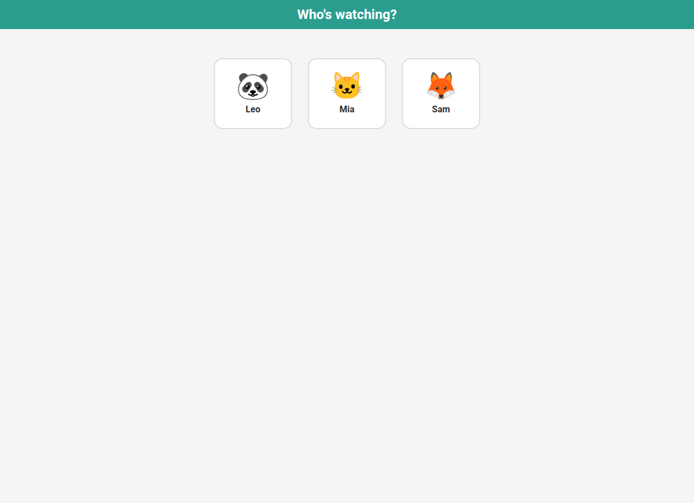
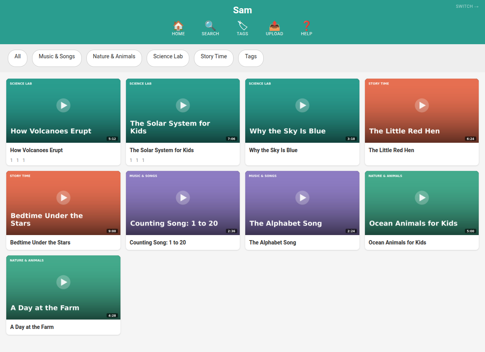
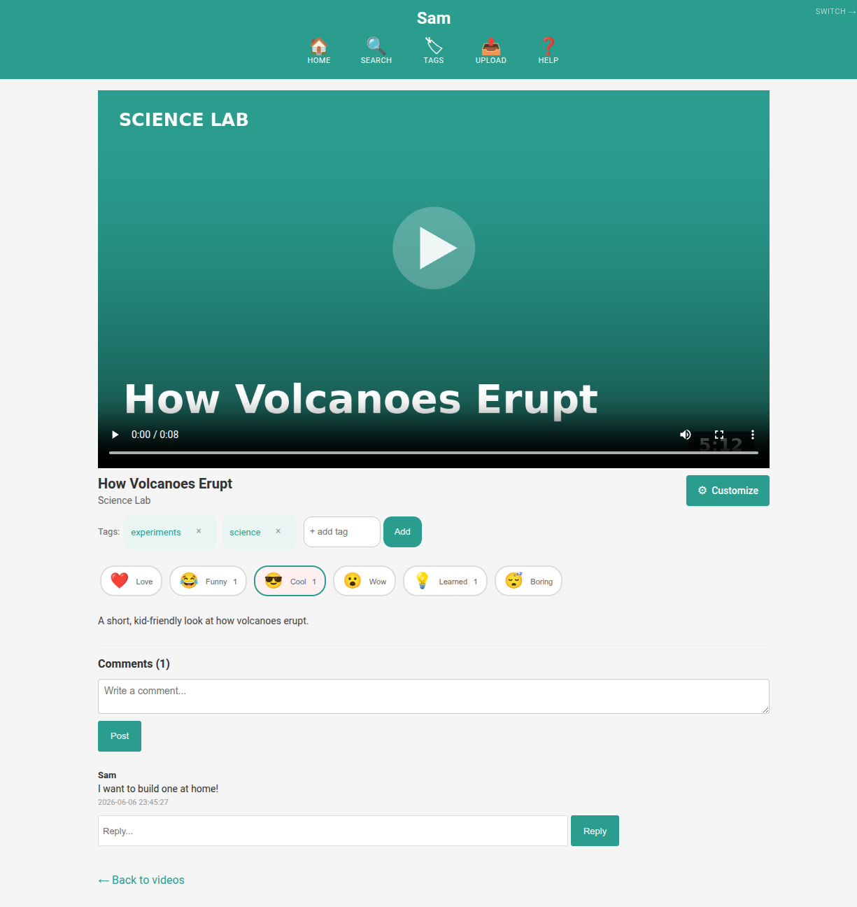
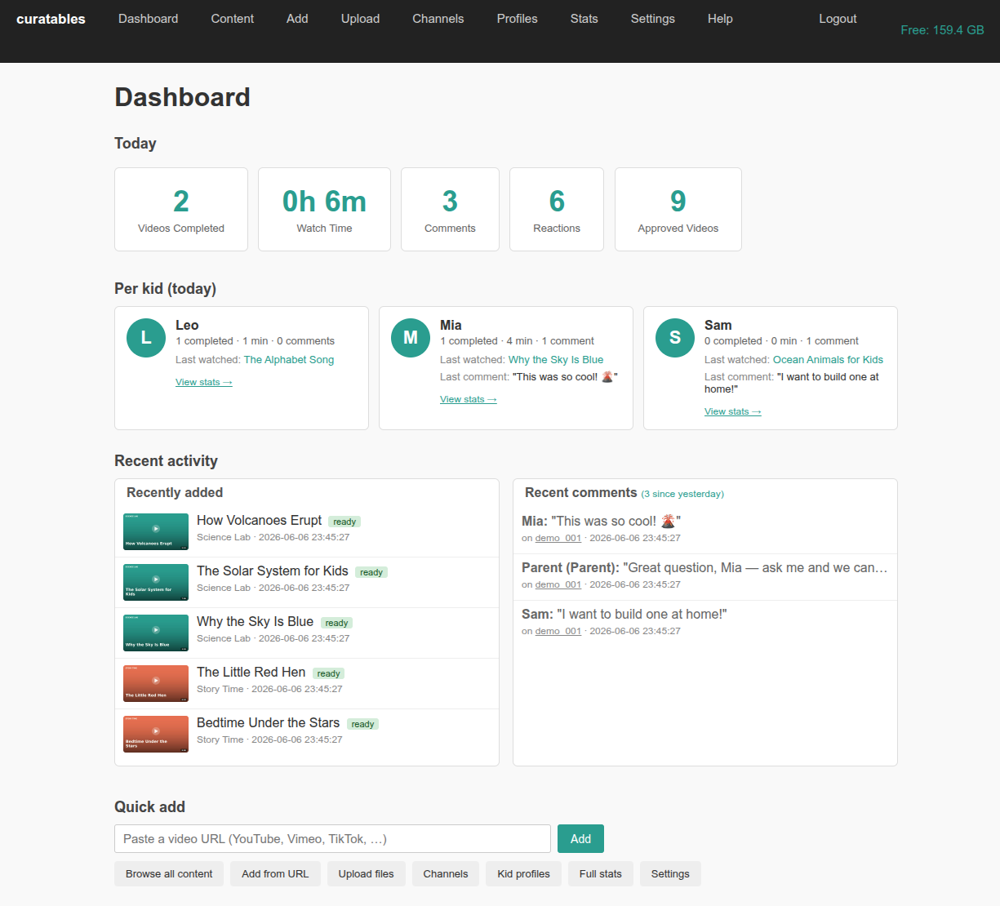
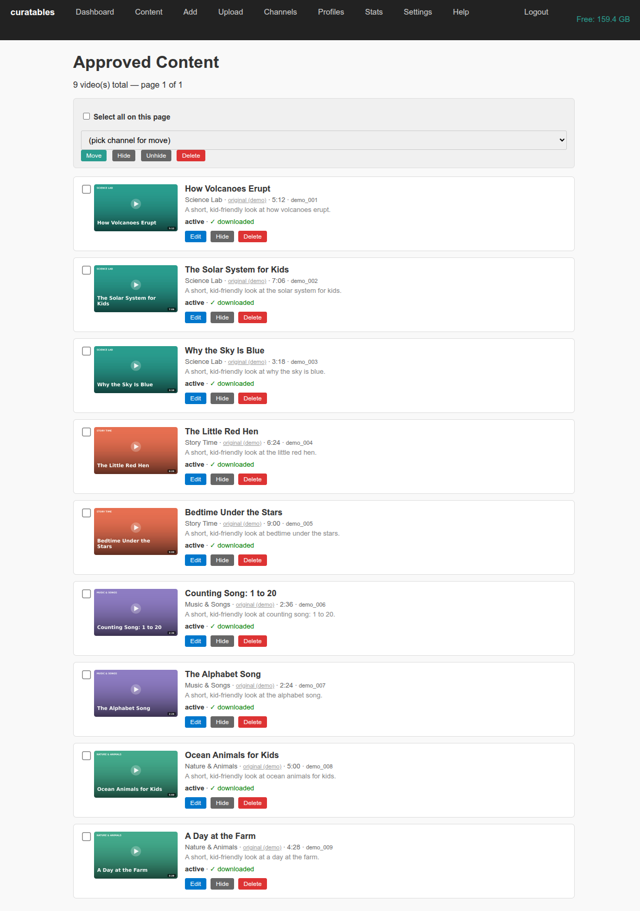
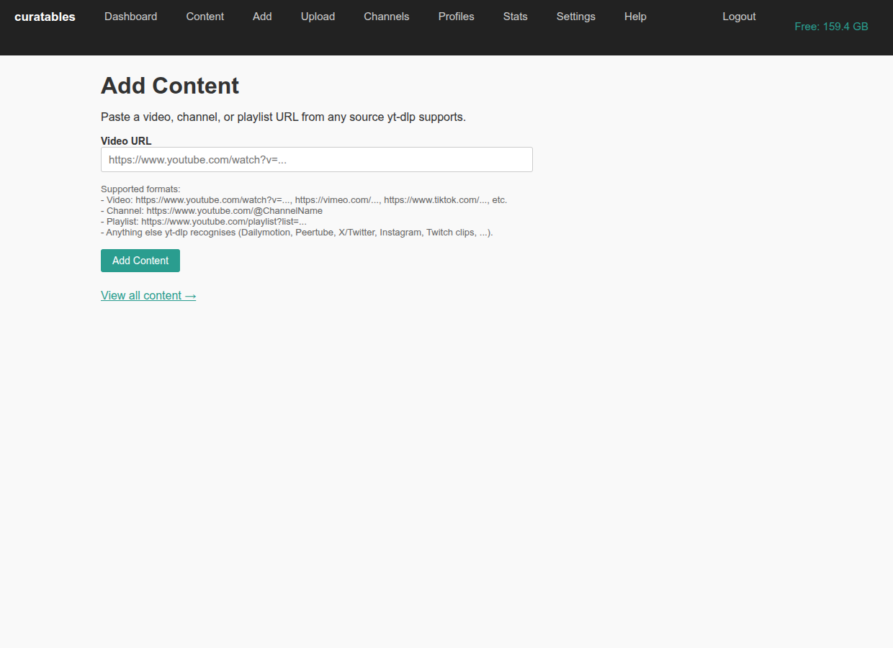
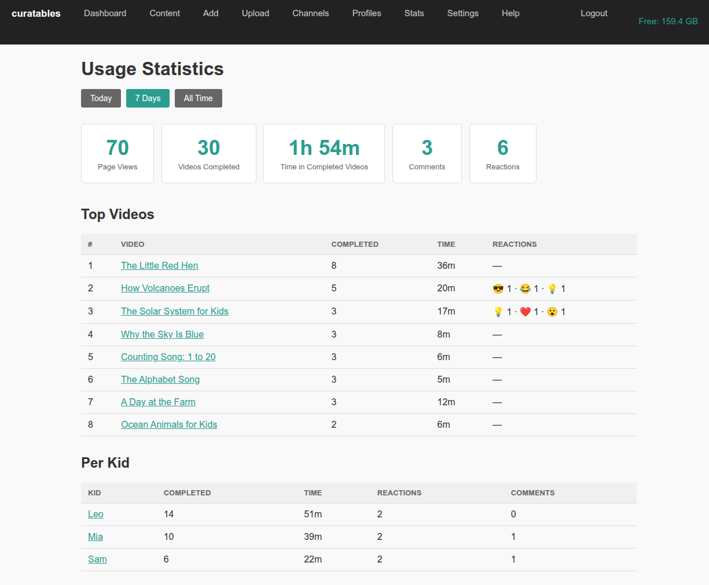
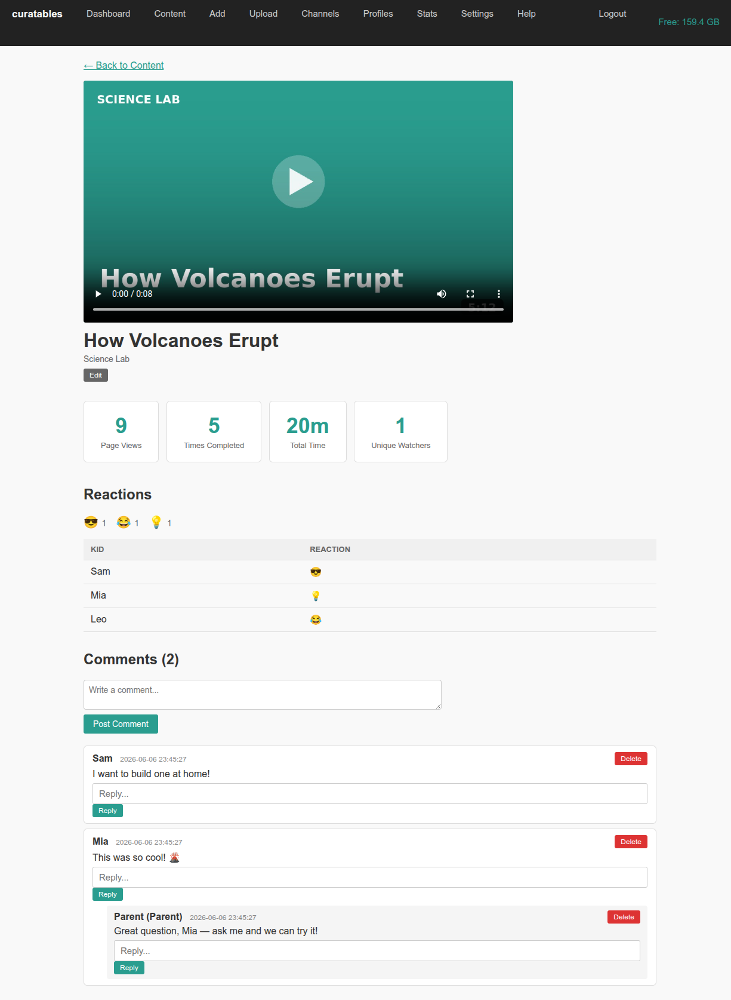
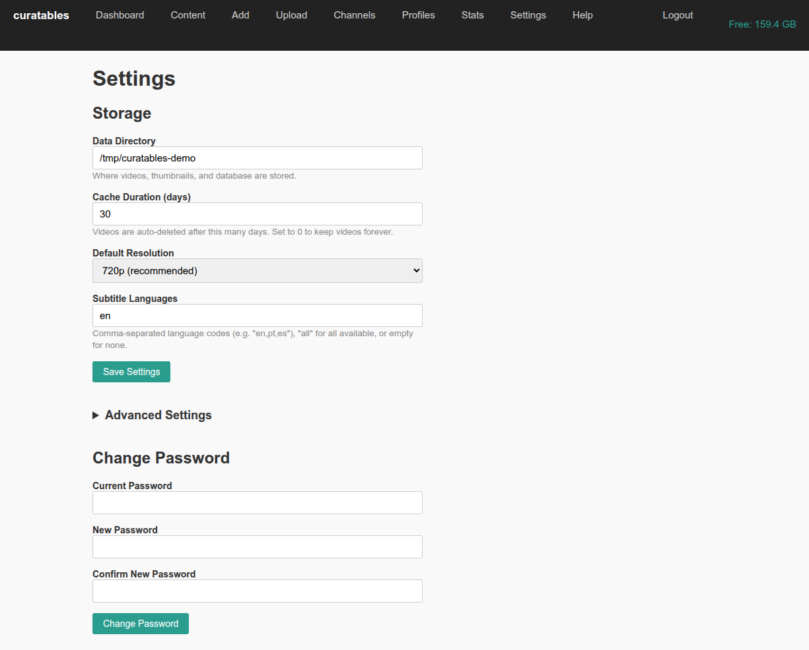

# curatables

A self-hosted server that lets parents curate videos (from YouTube, Vimeo, Dailymotion, TikTok, X, Instagram, PeerTube, TED — anything the amazing [yt-dlp](https://github.com/yt-dlp/yt-dlp) supports) for their children. Kids get a clean, ad-free, distraction-free video experience — parents stay in control. The server runs on a Linux box you operate yourself; phones, tablets, and laptops connect to it as clients over your home network.

## Why

The algorithmic feeds on YouTube, TikTok, Instagram and the rest are designed to maximize engagement, not child safety. Dedicated "kids" modes are widely criticized, parental controls are blunt, and parents rarely want to turn their kid loose on a platform feed even when the individual videos are fine. What they want is to pick exact videos, skip ads and recommendations entirely, and hand the result to a kid device that can't accidentally wander off.

curatables is the self-hosted answer: a small server you run on your own Linux machine, you curate approved content from the dashboard, and kids watch through a simple web interface on any device on the LAN.

> **New to this?** There's a friendly, step-by-step
> [Getting started guide](docs/getting-started.md) written for parents
> who can follow copy-paste instructions but aren't software developers.
> It walks through setting up a Raspberry Pi (or a spare laptop) from
> scratch.

## Who this is for (and who it isn't)

**curatables is a good fit if you:**
- have (or are willing to set up) a Linux box on your home network — a mini-PC, an old laptop, a Raspberry Pi, or any small Debian/Ubuntu-family server,
- are willing to follow step-by-step terminal instructions — you don't need to be a developer; the [Getting started guide](docs/getting-started.md) explains every command, and the installer script does most of the work,
- are happy to run a `systemd` service and rely on mDNS (`curatables.local`) for local discovery,
- want to curate content yourself and accept that the trade-off for "no algorithmic feed" is "you do the picking."

**It is *not* a good fit if you:**
- expect a one-click installer for macOS or Windows — there isn't one, those platforms work as *client* devices only (the kid's iPad can be macOS/iOS, the host cannot),
- want a hosted/cloud product with no server to maintain — curatables is bring-your-own-hardware on purpose,
- need a Docker-first, NAS-app, or desktop-app deployment today — these are on the [Roadmap → Future](#future) bucket as aspirations, not shipped paths.

The supported deployment is documented in [docs/deployment.md](docs/deployment.md); the canonical bill of materials is in [docs/dependencies.md](docs/dependencies.md).

## How It Works

1. **Parent** runs the server and opens the dashboard in a browser
2. **Parent** pastes a video, channel, or playlist URL (from any yt-dlp-supported source) to approve content
3. Videos are downloaded and stored locally via yt-dlp
4. Each video is **normalized to a device-friendly baseline** (H.264/AAC, ≤720p30, MP4 faststart) so it plays even on old hardware — a 2015 tablet, Safari/iOS 9 — where the source's VP9/AV1/Opus would otherwise show a black screen
5. **Kid** opens the kid-facing URL on any device (iPad, phone, laptop)
6. Kid sees only parent-approved videos — no ads, no recommendations, no rabbit holes
7. All viewing activity is logged for the parent to review

## Screenshots

_A seeded demo library — generic channels, videos, and kid profiles (no real data)._

**Kid side** — calm, finite, visual: pick a profile, tap to play, react/tag/comment. No autoplay, no recommendations, works back to Safari/iOS 9.

| Who's watching? | Video grid | Watch page |
|:---:|:---:|:---:|
| [](docs/screenshots/kid-profiles.png) | [](docs/screenshots/kid-home.png) | [](docs/screenshots/kid-watch.png) |

**Parent side** — glanceable triage: dashboard, content library, add-by-URL, usage stats, per-video moderation, settings.

| Dashboard | Content library | Add a video |
|:---:|:---:|:---:|
| [](docs/screenshots/parent-dashboard.png) | [](docs/screenshots/parent-content.png) | [](docs/screenshots/parent-add.png) |
| Usage stats | Per-video detail | Settings |
| [](docs/screenshots/parent-stats.png) | [](docs/screenshots/parent-content-detail.png) | [](docs/screenshots/parent-settings.png) |

## Current Status

A full-featured curation platform: everything through milestone **v0.5** ships
today. Highlights — see [CHANGELOG.md](CHANGELOG.md) for the complete shipped
history:

- **Curate** — add videos/channels/playlists by URL from any of yt-dlp's
  ~1,800 sources via a two-step *fetch → preview → confirm* flow; internal
  channels; bulk operations; export/import shared `.ytc`/text/PDF curation lists.
- **Playback that actually works on old devices** — every video is normalized
  on ingest to H.264/AAC ≤720p30 +faststart, streamed through the server (the
  kid device never touches the source). Subtitles, thumbnail caching, cache
  expiry with per-video "keep forever".
- **Kids** — clean responsive UI (works back to Safari/iOS 9), child profiles
  with PIN/avatar/theme, per-profile channel restrictions, curated search,
  emoji reactions, threaded family comments, per-kid titles/thumbnails/tags,
  kid-owned channels + bookmarks, kid uploads.
- **Parents** — dashboard with a "Needs attention" triage, stats (time windows,
  per-kid and per-video drill-downs, moderation), uploads (resumable tus.io +
  dedup + codec allow-list), disk-quota guard + storage report, data-dir
  relocation.
- **Ops** — `systemd` + mDNS (`curatables.local`), forward-only DB migrator,
  CSRF, backup/restore scripts. Full design in [docs/architecture.md](docs/architecture.md).

**Not yet implemented** (see [Roadmap](#roadmap)): AI content-safety agent and
LLM usage export (v0.6), OAuth source authentication (v0.7), HTTPS via local CA
and cross-platform packaging (Future).

## Hardware: how much computer do you need?

Not much. Curatables itself is light — a **Raspberry Pi 4/5** or any
spare laptop/mini-PC running Debian/Ubuntu is plenty for a family. The
only part that wants some CPU is **re-processing each video on ingest**
(see [normalization](#how-it-works), step 4): a Pi 5 or a laptop does it
quickly, a Pi 4 does it slowly (minutes per video) but works fine.

> The larger hardware target (6c/12t, 16–32 GB
> RAM) is sized for the **unshipped v0.6 AI safety agent** running a local
> LLM alongside Curatables — see the [Roadmap](#v06--intelligence). It
> does **not** apply to running Curatables as it ships today.

## Quick Start

> **New to self-hosting?** Follow the
> [step-by-step Getting started guide](docs/getting-started.md) instead —
> it's written for non-developers and walks through a Raspberry Pi setup
> from scratch. The sections below are the condensed reference.

> **Canonical bill of materials**: [`docs/dependencies.md`](docs/dependencies.md)
> is the single source of truth for every package, binary, and runtime
> knob Curatables needs. Read it before packaging Curatables for a new
> environment (systemd, Docker, etc.) — it covers Python deps, system
> binaries, host-side mDNS resolver requirements, filesystem layout,
> capabilities, and containerization gotchas.

### One-shot installer (Debian/Ubuntu)

If you're on Debian or Ubuntu, `scripts/install.sh` does everything
below in one go: apt packages + Deno + venv + Python deps + dependency
check. `scripts/install.sh --dry-run` validates the whole flow in a
throwaway venv without touching your system. See
[docs/deployment.md](docs/deployment.md) for details.

### System packages (manual — Debian/Ubuntu family)

The supported host OS is a Debian/Ubuntu-family Linux (including
Raspberry Pi OS). macOS and Windows are **not supported as hosts** —
the deployment path (systemd unit, `CAP_NET_BIND_SERVICE` on port 80,
Avahi mDNS) is Linux-specific. macOS/Windows/iOS/Android still work
as *client* devices that browse the kid UI over the LAN.

These must be installed before the Python packages:

```bash
# Debian/Ubuntu/Raspberry Pi OS
sudo apt update
sudo apt install python3 python3-pip ffmpeg

# Deno (required by yt-dlp for YouTube extraction)
curl -fsSL https://deno.land/install.sh | sh
```

| Package | Why | Install |
|---------|-----|---------|
| **python3** (3.10+) | Server runtime | `apt install python3` |
| **ffmpeg** | Merge video+audio, subtitle processing | `apt install ffmpeg` |
| **deno** | JS runtime for yt-dlp YouTube extraction | `curl -fsSL https://deno.land/install.sh \| sh` |

### Install Python dependencies

```bash
pip install -r requirements.txt
```

This installs:
- `fastapi` + `starlette` — web framework and ASGI toolkit
- `uvicorn` — ASGI server
- `jinja2` — template engine
- `python-multipart` — form parsing (login, settings, add video, upload)
- `yt-dlp` — video/metadata extraction from any supported source
- `curl_cffi` — browser TLS impersonation (bypasses YouTube bot detection without login)
- `itsdangerous` — session cookie signing
- `prometheus_client` — counters behind the opt-in `/metrics` endpoint (off by default)
- `zeroconf` — mDNS advertisement so the server is reachable at `curatables.local` on the LAN (optional — server still boots without it)
- `reportlab` — PDF export for shared-curation channels (optional — `.ytc` and `.txt` export work without it)

See [`docs/dependencies.md`](docs/dependencies.md) for pinned version
ranges and the rationale behind each package.

### Run

```bash
python run.py
```

Then open:
- **Parent dashboard**: http://localhost:8080/parent/
- **Kid UI**: http://localhost:8080/

On first run, you'll set a parent password. Then start adding YouTube URLs.

From any other device on the same LAN, you can reach the server at
**http://curatables.local:8080/** (or **http://curatables.local/** if
you ran it on port 80) thanks to the mDNS advertisement. Windows
clients need Apple's Bonjour Print Services installed for `.local`
resolution to work; macOS, iOS, Linux (Avahi), and modern Android all
work out of the box. See [docs/deployment.md](docs/deployment.md) for
the production setup story.

### Options

```
python run.py --port 8080 --host 0.0.0.0 --data-dir ~/curatables-data
```

`--port 80` is supported too, but binding a privileged port requires
`CAP_NET_BIND_SERVICE`. The shipped `systemd/curatables.service` unit
file grants exactly that capability to an unprivileged user — see
[docs/deployment.md](docs/deployment.md) for the full install recipe.

### Data

All data is stored in `~/curatables-data/` by default (some paths are
pre-created at startup, others created on demand):
- `config.json` — server configuration
- `db/curatables.db` — SQLite database
- `videos/<video_id>/` — downloaded video files (normalized to H.264/AAC ≤720p30 +faststart), thumbnails, subtitles
- `uploads/<video_id>/` — uploaded video files (normalized the same way as downloads)
- `uploads/.tmp/` — in-progress resumable uploads; abandoned tmp files are swept on startup
- `thumbnails/custom/` — reserved for parent-uploaded custom thumbnails
- `thumbnails/profiles/<profile_id>/<video_id>.*` — per-kid custom thumbnail overrides (on demand)
- `channels/<channel_id>/{banner,icon}.*` — kid channel art (on demand)
- `logs/` — server access and error logs

## Architecture

See [docs/architecture.md](docs/architecture.md) for the full design.
For ops (systemd, mDNS, port 80) see [docs/deployment.md](docs/deployment.md),
for backup / restore see [docs/backup.md](docs/backup.md), and for
upgrading an existing install see [docs/upgrade.md](docs/upgrade.md).
The full doc set is indexed in [docs/README.md](docs/README.md).

**TL;DR**: Three-layer separation (routes → services → repositories), feature-per-directory structure, ViewerContext injected into every request, schema designed for the full product vision from day one.

```
app/
├── main.py              # FastAPI app factory
├── config.py            # Configuration (dataclass + JSON)
├── dependencies.py      # DI wiring (FastAPI Depends)
├── backends/            # Video source backends (yt-dlp extraction engine)
├── db/                  # Schema + SQLite connection + forward-only migrator
├── models/              # Plain dataclasses
├── repositories/        # SQL queries
├── services/            # Business logic (incl. normalize.py = playback baseline)
├── features/            # Route handlers (one dir per feature)
│   ├── _template/       # Skeleton for new features
│   ├── healthz/         # Health check endpoint
│   ├── parent_auth/
│   ├── parent_dashboard/  # /parent/ landing page
│   ├── parent_content/
│   ├── parent_channels/
│   ├── parent_profiles/
│   ├── parent_settings/
│   ├── parent_stats/
│   ├── parent_storage/    # Disk quota report and status
│   ├── parent_uploads/    # Resumable tus.io upload endpoints
│   ├── parent_sharing/    # Shared-curation export/import (v0.5)
│   ├── kid_profiles/
│   ├── kid_browse/
│   ├── kid_watch/
│   ├── kid_search/
│   ├── kid_comments/
│   ├── kid_uploads/       # Plain XHR multipart uploads for kids
│   ├── media/
│   └── api/
├── middleware/          # body_size, csrf, request_id
├── templates/base/      # Jinja2 templates
└── static/              # CSS, vendored tus-js-client

scripts/                 # install.sh, backup.sh, restore.sh, metrics.sh, check_codecs.sh
```

## Roadmap

**Shipped (v0.1–v0.5) + the playback/GUI delivery work** — child profiles &
theming, storage/uploads/caching, networking & multi-source discovery, and
shared curation are all done. See [CHANGELOG.md](CHANGELOG.md) for the full
feature-by-feature history. What's still ahead:

### v0.6 — Intelligence
- LLM-friendly usage data export (JSON/CSV)
- LLM-powered content recommendations for parents
- Viewing pattern analysis in stats dashboard
- **AI content-safety agent for live search / auto-approval.** An
  LLM-backed agent that evaluates videos against per-profile
  parent-configured safety criteria (age range, topic allow-list,
  topic block-list, language, duration ceilings, etc.) and decides
  per video:
  1. **Confident safe → auto-approve** and queue for download
     without parent intervention.
  2. **Uncertain → notify parent** with the flagged video and the
     agent's rationale; parent decides from a pending-review queue.
  3. **Confident unsafe → drop, but reversible.** The candidate is
     suppressed with a one-click "Show me anyway" recovery in
     `/parent/safety/dropped` — never silently destroyed.
  Runs on a local Ollama box, CPU-only 7B-class Q4 model, batch
  worker with thermal cooldown. Full design in
  [docs/v0.6-safety-agent.md](docs/v0.6-safety-agent.md): per-
  profile criteria schema, queue and verdict tables, failure
  modes, parent UX surfaces, performance budget on the target
  hardware (16 GB / 6c12t / no GPU). Implementation will follow
  the six-slice plan in [§11 of the design doc][safety-slices]
  (migration → service → worker → routes → lifespan wiring →
  live-search). Runs against live searches once a search feature
  exists.

[safety-slices]: docs/v0.6-safety-agent.md#11-implementation-slices

### v0.7 — Authenticated Sources
- OAuth 2.0 device authorization grant for YouTube: parent pairs a
  Google account from any phone/laptop (no browser on the server),
  refresh token stored encrypted in `curatables.db`, yt-dlp requests
  are signed with the access token. Dodges bot-detection entirely for
  that account, unlocks age-restricted content, shifts rate limits
  from IP-based to account-based. Complements the curl_cffi
  impersonation path — doesn't replace it (anonymous sources still
  use impersonation).
- Equivalent auth flows for other platforms where they exist
  (Vimeo private videos, etc.) behind the same "Connect account"
  surface in parent settings.

### Future
- Cross-platform host packaging — aspirational, not shipped. The
  bare-metal Linux path is the supported one today. Things in this
  bucket: Docker image (the in-progress notes live in
  [docs/dependencies.md](docs/dependencies.md)), AppImage, NAS
  packages (Synology, QNAP), desktop installers for macOS/Windows,
  pre-built Raspberry Pi image, Termux setup script for old Android
  phones.
- QR code for kid device setup (print/display a code that opens
  `http://curatables.local/` on any phone/tablet without typing)
- QR-code import of shared curation lists (scan another parent's QR
  to import their .ytc payload)
- Subscribe to hosted `.ytc` files for updates (periodic fetch + diff
  against the local library; surface new videos in a parent review queue)
- Optional local CA for HTTPS (self-signed root the parent can install
  on household devices so `curatables.local` speaks TLS)
- Open search mode with parent review queue
- Playlist auto-sync (check for new uploads)
- **Internationalisation (i18n).** English-only excludes most
  parents globally. Wrap `app/templates/` strings, ship at least
  one second language end-to-end, and add per-profile language
  preference. Effort: 1–2 weeks.
- **Accessibility audit (WCAG 2.1 AA).** "Safari iOS 9 compat" is
  honored; focus order, ARIA labels, screen-reader paths, contrast,
  motor target sizes are not measured. Run axe-core / Lighthouse on
  the kid pages, do a manual VoiceOver / ChromeVox pass, document
  findings + fixes in `docs/accessibility.md`. Effort: 3–5 days.
- **Parallel test runs.** Suite is ~2.5 min today; at 1,000+ tests
  that doubles the dev loop on every iteration. Add `pytest-xdist`,
  audit conftest fixtures for shared state (the migrator + sqlite
  test db are the main risk), update CI. Effort: half a day.

## Contributing

See [CONTRIBUTING.md](CONTRIBUTING.md) for dev setup, the test
suite, the routes → services → repositories layering rule, and
the migration / TemplateResponse / multi-source conventions.
Bug reports and feature requests use the GitHub issue templates
under [`.github/ISSUE_TEMPLATE/`](.github/ISSUE_TEMPLATE);
PRs use [`.github/PULL_REQUEST_TEMPLATE.md`](.github/PULL_REQUEST_TEMPLATE.md).

By participating you agree to the
[Code of Conduct](CODE_OF_CONDUCT.md) (Contributor Covenant 2.1).
Security issues go through [SECURITY.md](SECURITY.md), not the
public issue tracker.

The short version of the architecture rule:

1. New features go in `app/features/<your_feature>/`
2. Routes call services, services call repositories
3. SQL lives in repositories, business logic in services, routes are thin
4. Wire your router in `app/main.py` (one line)
5. Copy `app/features/_template/` to get started

## License

Licensed under the [Apache License, Version 2.0](LICENSE). Copyright 2026 Ricardo de Azambuja.
